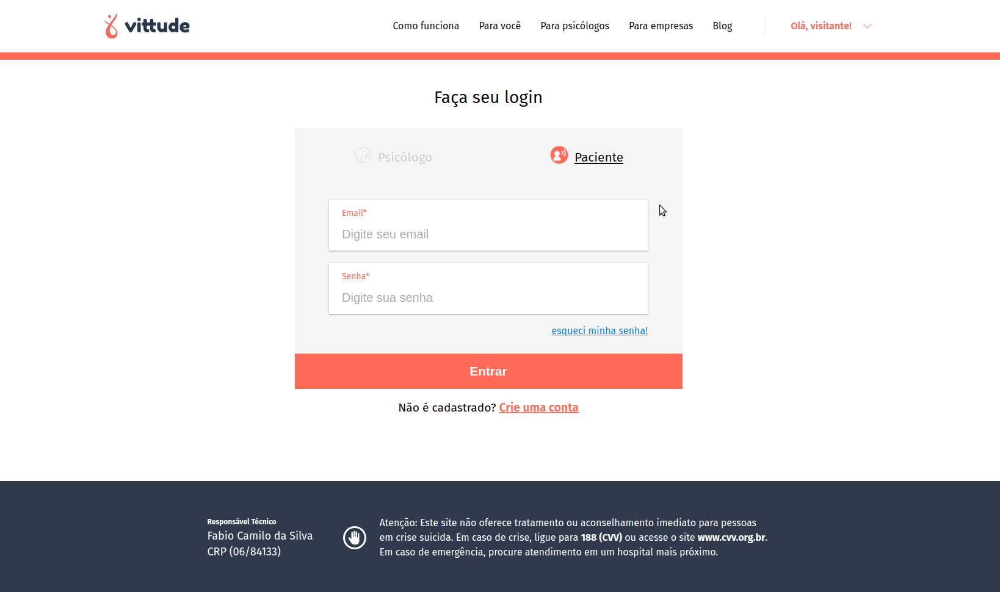

<h1 align="center">
   🛍️ <a href="#"> Vittude Login </a>
</h1>

<h4 align="center"> 
	 Status: Finished
</h4>

<p align="center">
 <a href="#layout">Layout</a> • 
 <a href="#how-it-works">How it works</a> • 
 <a href="#pre-requisites">Pre-requisites</a> • 
 <a href="#tech-stack">Tech Stack</a> • 
 <a href="#how-to-contribute">How to contribute</a> • 
 <a href="#author">Author</a>
</p>


---


## Layout

<div align="center">
 
</div>

---

## How it works

This project is divided into two parts:
1. MockedApi (You can find here: https://github.com/samuelfcf/vittude-auth-mockapi)
2. Frontend (This repository)

---

## Pre-requisites

Before you begin, you will need to have the following tools installed on your machine:
[Git](https://git-scm.com), [Node.js](https://nodejs.org/en/), [VSCode](https://code.visualstudio.com/).

### Running the Frontend


``` jsx

// Clone this repository
$ git clone git@github.com:samuelfcf/vittude-login.git

// Access the project folder cmd/terminal
$ cd vittude-login

// Install the dependencies
$ yarn install

// If you want to run your app on localhost, create a .env file with the environment variable pointing to your local server.

// Run the application in development mode
$ yarn start

// The server will start at port: 3000

```

You can find an .env.example <a href="https://github.com/okitauehara/atelie-front/blob/main/.env.example">here</a>.


---

## Tech Stack

The following tools were used in the construction of the project:

**Frontend**  ([React](https://reactjs.org/))

-   **[Axios](https://github.com/axios/axios)**
-   **[React-icons](https://github.com/react-icons/react-icons)**
-   **[Styled-components](https://github.com/styled-components/styled-components)**
-   **[SweetAlert](https://sweetalert.js.org/)**
-   **[Eslint - Airbnb](https://github.com/airbnb/javascript)**
-   **[Prettier](https://github.com/prettier/prettier)**
-   **[Brazilian Values](https://github.com/VitorLuizC/brazilian-values)**

> See the file  [package.json](https://github.com/samuelfcf/vittude-login/blob/main/package.json)


---

## Author

Developed by Samuel Felipe Castro Fernandes.